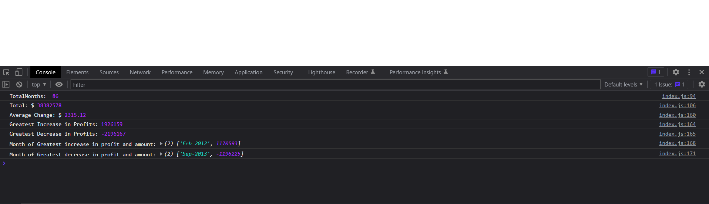

# Unit 4 Challenge: Console Finances

## Overview

In this challenge, you'll be using the concepts you've learned to complete the required activity. This activity presents a real-world situation in which your newfound JavaScript skills will come in handy. You are tasked with creating code for analyzing the financial records of a company. You have been provided with a financial dataset in the `starter/index.js` file.

## Usage

* Screenshot of page

 

## Deployed Application

* Link to deployed application:

* https://ailsadm.github.io/Bootcamp-Challenge4/
